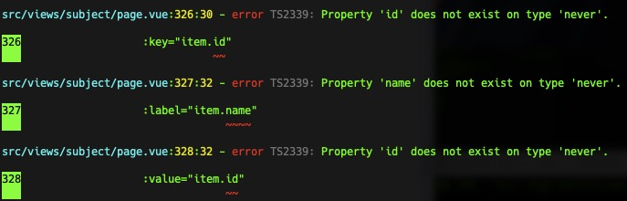

## 忽略报错

单行忽略

<!-- // @ts-ignore -->
// @ts-expect-error

忽略全文

// @ts-nocheck

取消忽略全文

// @ts-check

## Property 'msg' does not exist on type 'AxiosResponse<any, any>'

`axios` `api` 请求返回错误。
将 `api` 请求的 `res` 加上 `type` ：

`.then((res)=>{` -> `.then((res: any)=>{`

## Property 'id' does not exist on type 'never'

由于 `vue-tsc --noEmit && vite build` 对 `ts` 的检查导致。

给对应的位置添加 ts 类型。

