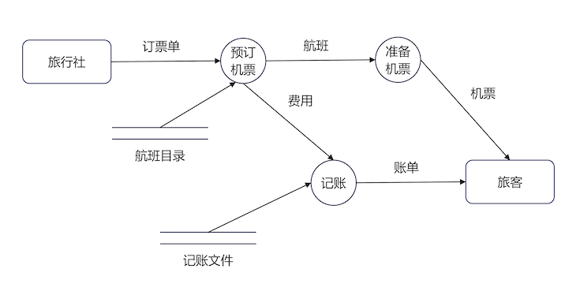

`结构化分析(SA)`采用自顶向下.

## 术语

- 数据流
在`带箭头的实线上`标注文字。
- 加工
`圆圈框住文字`。接受输入的数据，对其进行处理，并产生输出。
- 存储
`两条横实线上标注`文字。
- 数据源和数据潭
`方框框住文字`，数据源表示数据流起点，数据潭表示数据流的归宿地。

## 数据流图DFD

`数据流图(Dataflow Diagram,DFD)`用表示`功能模型`；用`E-R图(实体联系图)`表示`数据模型`；用`状态装换图`表示`行为模型`。

DFD又分为：变换型数据流程图(一个加工后有2个加工)、事务型流程图(一个加工后有超过2个加工)。

描述加工可使用：结构化自然语言、判定表、判定树。

## 结构化设计

### 总体设计

工具：模块结构图(MSD)、层次图、HIPO图(层次图+输入/处理/输出)。 `高内聚低耦合`

总体设计步骤：

- 变化设计
  - 设计准备——复审并精化系统模型
  - 确定输入、变换、输出这三部分之间的边界
  - 第一级分解——系统模块结构图顶层和第一层的设计
  - 第二级分解——自顶向下，逐步求精
- 事务设计
  - 设计准备——复审并精化系统模型
  - 确定事务处理中心
  - 第一级分解——系统模块结构图顶层和第一层的设计
  - 第二级分解——自顶向下，逐步求精

## 耦合内聚

耦合：指不同模块之间相互依赖程度的度量。高耦合，指两个模块之间存在着很强的依赖。低耦合、无耦合。
内聚：指一个模块内部各成分之间相互关联程度的度量。

### 启发式规则

- 改进软件结构，提供模块独立性
- 力求模块规模始终
当模块语句数超过30行后，其可理解程度迅速下降，一个模块最好能写在一页纸内(即不超过60行)。
- 力求深度、宽度、扇出和扇入适中
深度即层数。
宽度，即同一层上模块总数的最大值。
扇出，即一个模块直接下级的模块数目。
扇入，即一个模块的直接上级模块数目。
- 尽力是模块的作用域在其控制域之内
- 尽力降低模块接口的复杂度

## 详细设计

3种基本控制结构：`顺序`、`选择`、`循环(do-while结构)`。

工具：程序流程图、盒图(N-S图)、PAD图(Problem Analysis Diagram)、PDL(Program Design Language,PDL,伪码)、IPO图、判定树、判定表等。

产生模块描述，测试需求等文件。
